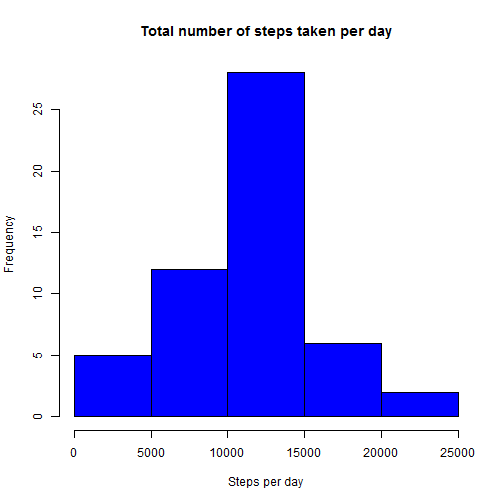
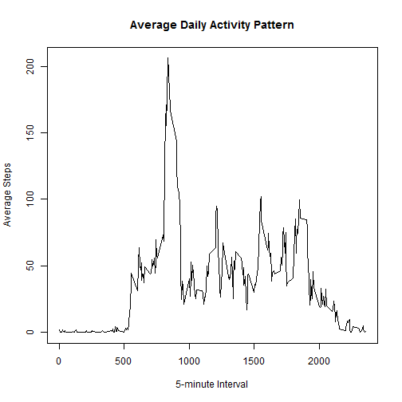
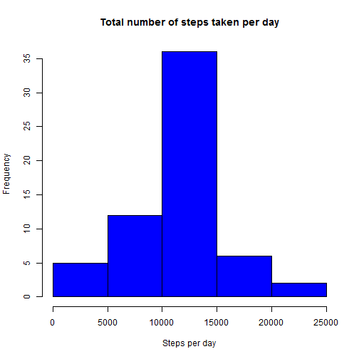
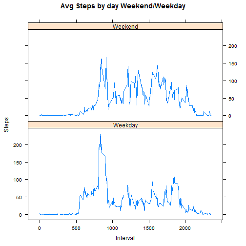

```r
## Load the following libraries
library(plyr)
library(lattice)

## Read activity.csv data into R
actData <- read.csv("activity.csv", sep=",")

## Convert the date as date 
actData$date <- as.Date(actData$date, "%Y-%m-%d")

## Remove "NA" from the data
naData <- na.omit(actData)

## Convert the steps as numeric
naData$steps <- as.numeric(naData$steps)
```


# What is mean total number of steps taken per day?


```r
## Sum up total steps for each day using aggregate
stepsDay <- aggregate(steps ~ date, naData, sum)

#Make the histogram.
hist(stepsDay$steps, main="Total number of steps taken per day", xlab="Steps per day", col="blue")
```

 


```r
## Calculate the mean and median
meanSteps <- mean(stepsDay$step)
medianSteps <- median(stepsDay$step)
meanSteps
```

```
## [1] 10766.19
```

```r
medianSteps
```

```
## [1] 10765
```

The mean of total number of steps taken per day: 10766.19.  The median of total number of steps taken per day: 10765.


# What is the average daily activity pattern?


```r
## Calculate the average daily activity pattern
uniqueInterval <- unique(naData$interval)
avgStep <- tapply(naData$steps, naData$interval, mean)

## Plot a line graph
plot(uniqueInterval, avgStep, type="l", ylab="Average Steps", xlab="5-minute Interval", main="Average Daily Activity Pattern")
```

 


```r
## maximum number of steps in 5-min interval

# Imputing missing values
maxSteps <- names(which.max(avgStep))
maxSteps
```

```
## [1] "835"
```

The maximum number of steps in 5-minute interval: 835.


# Inputing missing values


```r
## Subtract the number of rolls from raw data to NA removed data
misVal <- nrow(actData) - nrow(naData)
misVal
```

```
## [1] 2304
```

The total number of missing values in the dataset: 2304.


```r
## Generate logical NA and look for NA in the original dataset and
## replace NA with the mean of 5-min interval
isna <- is.na(actData)
dupData <- actData
dupData$steps[which(isna)] <- avgStep[match(actData$interval[which(isna)], actData$interval)]
```


```r
## Generate a new histogram based on the NA populated data
popSteps <- aggregate(steps ~ date, dupData, sum)
hist(popSteps$steps, main="Total number of steps taken per day", xlab="Steps per day", col="blue")
```

 


```r
## Calculate the mean and median
pmeanSteps <- mean(popSteps$step)
pmedianSteps <- median(popSteps$step)
pmeanSteps
```

```
## [1] 10766.19
```

```r
pmedianSteps
```

```
## [1] 10766.19
```

The mean of total number of steps taken per day: 10766.19.  The median of total number of steps taken per day: 10766.19.  The two values are idential and doesn't seem to be impacted by replacing NA value with average value of the same interval.  

# Are there differences in activity patterns between weekdays and weekends?


```r
## Create a factor variable in the dataset with two levels - "weekday" and "weekend"

day <- dupData$date
dupData <- cbind(dupData, day)

dupData$day <- as.character(weekdays(dupData$day))

dupData$day <- gsub("Monday", "Weekday", dupData$day)
dupData$day <- gsub("Tuesday", "Weekday", dupData$day)
dupData$day <- gsub("Wednesday", "Weekday", dupData$day)
dupData$day <- gsub("Thursday", "Weekday", dupData$day)
dupData$day <- gsub("Friday", "Weekday", dupData$day)
dupData$day <- gsub("Saturday", "Weekend", dupData$day)
dupData$day <- gsub("Sunday", "Weekend", dupData$day)
dupData$day <- as.factor(dupData$day)
```


```r
## Make a line plot containing a time series of the 5-min interval

newavgStep <- ddply(dupData, .(interval, day), summarize, steps = mean(steps))

xyplot(steps ~ interval | day, data=newavgStep, type="l", layout=c(1,2), xlab="Interval", main="Avg Steps by day Weekend/Weekday", ylab="Steps")
```

 
